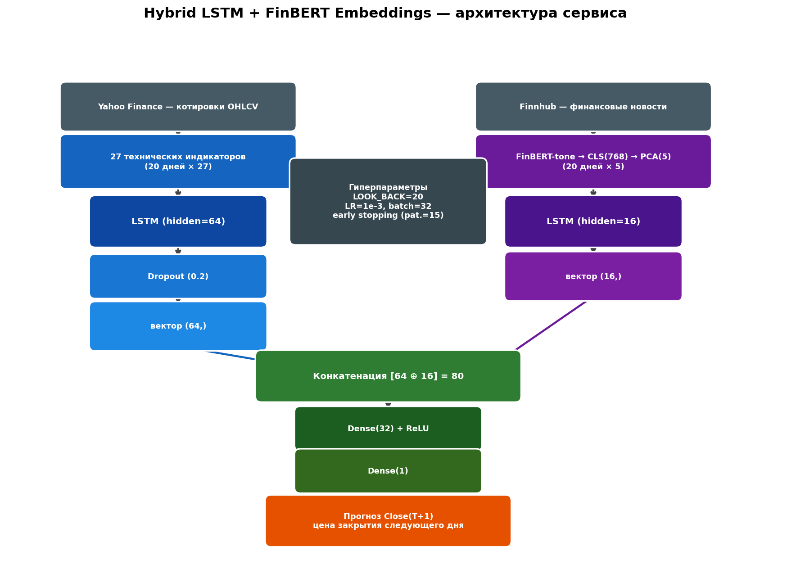

# 📈 Stock Forecast Service — Hybrid LSTM + FinBERT


**Сервис прогнозирования цены акций на основе гибридной нейросетевой модели, объединяющей технический анализ и NLP-обработку финансовых новостей.**

Проект вырос из дипломного исследования *«Прогнозирование курса акций на основе гибридных моделей машинного обучения с использованием финансовых новостных данных»* и превращает его результаты в работающий веб-сервис: модель автоматически подтягивает свежие котировки и новости, оценивает новостной фон с помощью FinBERT и прогнозирует цену закрытия следующего торгового дня для **Apple (AAPL)** и **Tesla (TSLA)**.

---

## 🧠 Архитектура модели

В дипломном исследовании на rolling-window валидации сравнивались ARIMA, Random Forest, базовая LSTM и три гибридных варианта (LSTM+Sentiment, LSTM+Embeddings, LSTM+Attention). Лучший результат показала **двухпоточная LSTM с конкатенацией новостных эмбеддингов** — она и используется в сервисе:



- **Поток 1 — рынок:** окно из 20 торговых дней × 27 технических индикаторов (MA, EMA, RSI, MACD, Bollinger Bands, ATR, ADX, OBV, Stochastic и др.) → `LSTM(64)` → `Dropout(0.2)`
- **Поток 2 — новости:** заголовки и аннотации новостей проходят через **FinBERT-tone**; CLS-эмбеддинги (768) усредняются по дням и сжимаются `PCA → 5` компонент → `LSTM(16)`
- Скрытые состояния конкатенируются `[64 ⊕ 16] = 80` → `Dense(32) + ReLU` → `Dense(1)` → прогноз `Close(T+1)`

## 🔄 Что изменилось относительно дипломной работы

| | Диплом | Сервис |
|---|---|---|
| Новостные данные | статичный датасет твитов 2015–2019 (Hugging Face) | живая лента новостей **Finnhub** — модель переобучается на актуальных данных и работает в реальном времени |
| Назначение | исследование (9 скриптов, сравнение 6 моделей) | production-подобный пайплайн: `train` → артефакты → `predict` → веб-интерфейс |
| Учёт выходных | новости нерабочих дней терялись при join | новости выходных относятся к **следующему торговому дню** |
| Валидация | 3 rolling-окна | хронологический сплит 70/15/15 + сравнение с наивным бенчмарком «завтра = сегодня» |
| Доступ | локальные скрипты | Streamlit-приложение, Docker, деплой на Hugging Face Spaces |

## 🖥️ Что умеет сервис

- выбор акции (AAPL / TSLA) и прогноз `Close(T+1)` одной кнопкой;
- свечной график последнего окна модели с прогнозной точкой;
- лента последних новостей с индивидуальной тональностью FinBERT;
- агрегированный «новостной фон» дня (sentiment score);
- метрики качества модели на отложенном тесте (MAE, RMSE, MAPE, Directional Accuracy) в сравнении с наивным прогнозом;
- график «факт vs прогноз» на тестовом периоде.

## 🚀 Быстрый старт

```bash
git clone https://github.com/<your-username>/stock-forecast-service.git
cd stock-forecast-service

python -m venv .venv && source .venv/bin/activate   # Windows: .venv\Scripts\activate
pip install -r requirements.txt

# бесплатный API-ключ новостей: https://finnhub.io
export FINNHUB_API_KEY=<ваш ключ>                    # Windows: set FINNHUB_API_KEY=...

# 1. обучение моделей на данных за последний год (~10–20 мин на CPU)
python -m src.train --all

# 2. прогноз из консоли
python -m src.predict --ticker AAPL

# 3. веб-интерфейс
streamlit run app/streamlit_app.py
```

Оффлайн-проверка пайплайна без API-ключей (синтетические данные):

```bash
python tests/test_model.py
python tests/test_train_smoke.py
```

## 🐳 Docker

```bash
docker build -t stock-forecast .
docker run -p 8501:8501 -e FINNHUB_API_KEY=<ключ> stock-forecast
```

## ☁️ Деплой на Hugging Face Spaces (бесплатно)

1. Создайте Space: **New Space → SDK: Streamlit**.
2. Запушьте репозиторий в Space и добавьте в начало README Space YAML-шапку:
   ```yaml
   ---
   title: Stock Forecast
   sdk: streamlit
   app_file: app/streamlit_app.py
   ---
   ```
3. В **Settings → Variables and secrets** добавьте секрет `FINNHUB_API_KEY`.
4. Обученные артефакты (`artifacts/`) коммитятся вместе с кодом — они лёгкие (~1 МБ на тикер); FinBERT скачается автоматически при первом запуске.

После сборки Space выдаёт публичную ссылку — сервисом можно пользоваться из браузера без установки.

## 📁 Структура проекта

```
├── config.py                  # единая конфигурация (тикеры, признаки, гиперпараметры)
├── src/
│   ├── data/
│   │   ├── prices.py          # yfinance + 27 технических индикаторов
│   │   └── news.py            # Finnhub (fallback: yfinance news), выравнивание на торговые дни
│   ├── features/
│   │   ├── sentiment.py       # FinBERT-tone: тональность + CLS-эмбеддинги
│   │   └── dataset.py         # сборка датасета: цены ⊕ новости
│   ├── models/
│   │   └── hybrid_lstm.py     # двухпоточная LSTM+Embeddings
│   ├── train.py               # обучение + сохранение артефактов
│   └── predict.py             # live-инференс: свежие данные → прогноз
├── app/streamlit_app.py       # веб-интерфейс
├── artifacts/{TICKER}/        # model.pt, скейлеры, PCA, метрики, тестовые прогнозы
├── tests/                     # юнит-тесты модели + оффлайн smoke-тест пайплайна
├── assets/make_diagram.py     # генерация схемы архитектуры
└── Dockerfile
```

## 🔬 Методологические детали

- **Без утечки данных:** MinMax-скейлеры, StandardScaler эмбеддингов и PCA обучаются **только на train-части**; при инференсе используются сохранённые объекты.
- **Последовательности** строятся на всём ряду, а сплит выполняется по позиции таргета — контекст валидации/теста состоит только из прошлого, при этом строки не теряются на границах.
- **Целевая переменная** — цена закрытия следующего торгового дня; метрики считаются в реальных ценах после обратного преобразования.
- **Directional Accuracy (DA)** — доля правильно угаданных направлений движения цены; для трейдинга важнее абсолютной ошибки.
- **Артефакты инференса:** `model.pt` + `scaler_X` + `scaler_y` + `emb_scaler` + `pca` + `meta.json` — всё, что нужно для воспроизводимого прогноза.

## ⚠️ Дисклеймер

Проект создан в учебных и исследовательских целях. Прогнозы модели **не являются инвестиционной рекомендацией**; рынок акций подвержен влиянию факторов, не учитываемых моделью.

## 📄 Лицензия

MIT
